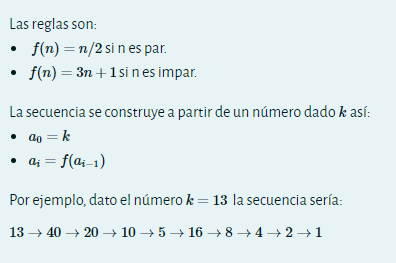
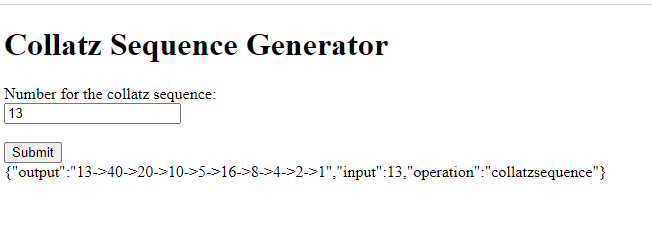
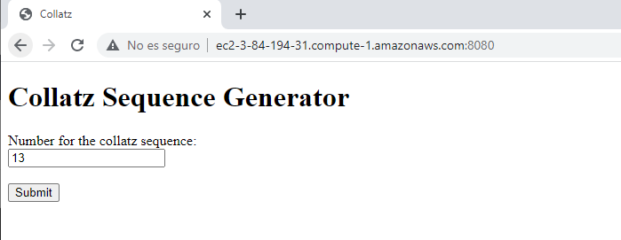

# Collatz sequence generator
## 

El siguiente proyecto consiste en un generador de la secuencia collatz
Esta secuencia funciona con las siguientes reglas



## Requerimientos
- git
- maven
- docker

## Como usarlo

Para poder usar este proyecto es necesario clonarlo primero con:
```
git clone https://github.com/Diegoruro/segundoparcialArep.git
```
Paso seguido este se debe compilar en la carpeta raiz del proyecto con:
```
mvn clean install
```
Una vez ya se compila se crea la imagen con docker con el siguiente comando:
```
docker build -t {nombreDeLaImagen} .
```
Ya creada la imagen para poder correrlo ejecutamos la siguiente linea:
```
docker run -d -p {puerto}:6000 --name {nombreDelContenedor} {nombreDeLaImagen}
```
ya con esto puedes ir a http://localhost:{puerto} para empezar a usar la aplicacion


## Funcionamiento

Ingresamos a la pagina web y escogemos el numero para la secuencia, luego le damos click al boton "submit"



## Desplegar en EC2

para poder desplegar esta aplicacion en EC2 es necesario ingresar a AWS y levantar una instancia una vez se levanta la instancia ingresamos a esta por ssh con el siguiente comando ejemplo:
```
ssh -i "parcial.pem" ec2-user@ec2-3-84-194-31.compute-1.amazonaws.com
```

luego procedemos a instalar docker e iniciarlo
```
sudo yum update -y
sudo yum install docker
sudo service docker start
``` 
para evitar usar sudo ejecutamos el siguiente comando, salimos y volvemos a entrar a la instancia con ssh:
```
sudo usermod -a -G docker ec2-user
```
Ya en la instancia de nuevo para poder correr la aplicacion ejecutamos el siguiente comando:
```
docker run -d -p {puerto}:6000 --name {nombreDelContenedor} diegoruroeci/sparkweb:parcial
```
con esto es suficiente y nos dirigimos por medio de un navegador a la url:
```
http://{Public IPv4 DNS de la instancia}:{puerto}
```
ejemplo:
```
http://ec2-3-84-194-31.compute-1.amazonaws.com:8080
```



video del funcionamiento:
https://www.youtube.com/watch?v=_NVtKQGI7Mo
